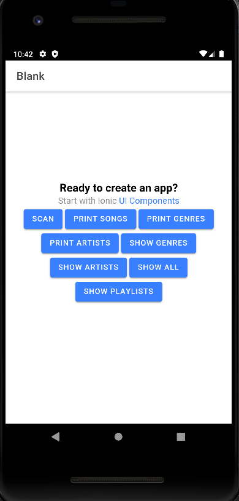
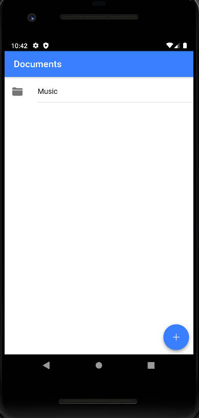
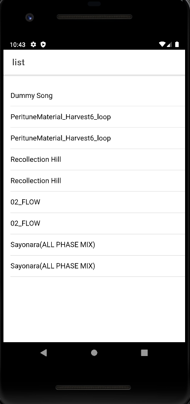
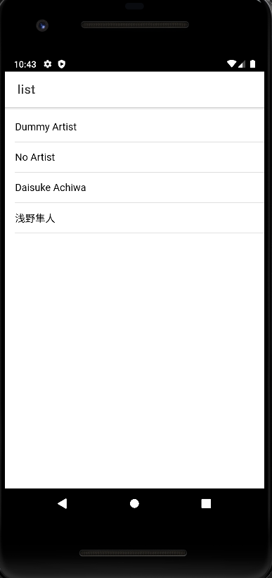
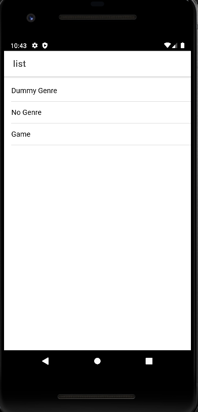
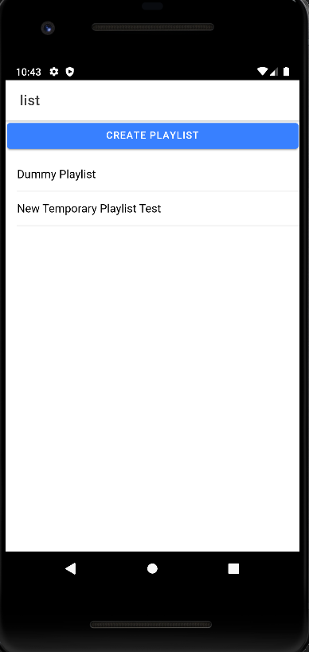

# Capstone_Project || Music Streaming System with Mobile Music Player Application
----------------------------------------

## Updated 2022 / 03 / 18 (YYYY / MM / DD ) 

###### Description

Project is built with the MEAN stack and includes technologies such as NodeJS, MongoDB, Angular, and Ionic. The app is designed to 
cater to independent music creators or podcast content creators as it will allow creators to upload and share their content without restrictions. 
The app utilizes a mobile music player application built with Ionic / Angular as the frontend where the user can login 
to access backend features to upload, manage, search, and stream content from other users.

----------------------------------------

###### Installation & Run Guide

* Requires NodeJS, Ionic CLI and Android Studio (API 28 Android 9.0) Installation

* Clone repository

* in the backend/config/config.js file input any string into the jwtSecret property and a MongoDB connection URI in the db property

	* jwtSecret: '<anything_goes_here>',
	* db: '<MongoDB_Connection_URI>'

* In the backend folder run command ( npm install )

* In the backend folder run command ( npm start )

* In the frontend folder run command ( npm install )

* In the frontend folder run command ( ionic capacitor build android )

* In the frontend folder run command ( ionic capacitor run android ) ( Select the android emulator or connected android phone )

----------------------------------------

Current frontend development progress as of 2022 / 03 / 18

(Scan local phone documents folder for songs and stores in SQLite local storage) 
(Create, Edit, and Delete Playlist, Add Songs to Playlist) 
(View songs by All, Artist, or Genre) 

----------------------------------------

### Documents

Project Summary 
[Project Summary Word Doc](documents/F21_T24_Project%20Summary.pdf)

Project Vision 
[Project Vision Word Doc](documents/F21_T24_Project%20Vision%20.pdf)

Project / Business Requirements 
[High Level Requirements Word Doc](documents/F21_T24_High%20Level%20Requirements.pdf)

Project Plan 
[Project Plan Word Doc](documents/F21_T24_Project%20Plan.pdf)

Requirements Analysis and Design 
[Requirements Analysis & Design Word Doc](documents/T24_Requirements%20Analysis%20and%20Design.pdf)

Wireframes / Mockups 
[Mockup PDF](documents/F21_T24_MockUp.pdf)

Status Reports 
[Status Report 1 Word Doc](documents/W22_T24_ProjectReport1.pdf) 
[Status Report 2 Word Doc](documents/W22_T24_ProjectReport2.pdf)

System Implementation 
TBD

----------------------------------------

# comp3059_capstone
Repository for Capstone Project

Initialized nodejs with express, nodemon and mongoose dependencies